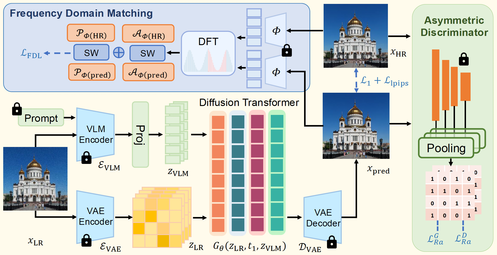
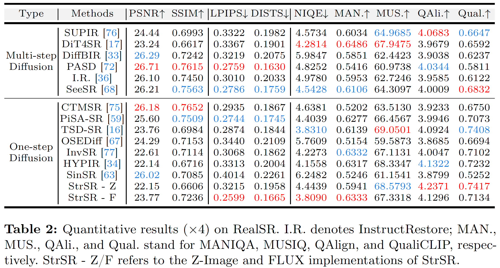
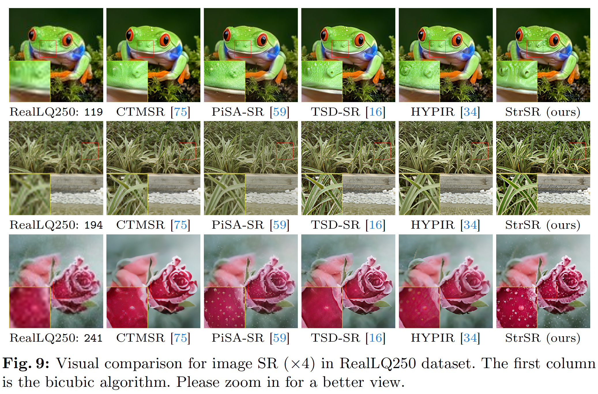

# Spectral and Trajectory Regularization for Diffusion Transformer Super-Resolution

[Jingkai Wang](https://jingkaiwang.com), [Yixin Tang](https://github.com/YOU-EEE), [Jue Gong](https://github.com/gobunu), Jiatong Li, Shu Li, Libo Liu, Jianliang Lan, [Yutong Liu](https://isabelleliu630.github.io/), [Yulun Zhang](http://yulunzhang.com/), "Spectral and Trajectory Regularization for Diffusion Transformer Super-Resolution", 2026

[](https://jkwang28.github.io/StrSR/)
[](https://arxiv.org/)
[](https://github.com/jkwang28/StrSR/releases)
[](https://github.com/jkwang28/StrSR)
[](https://github.com/jkwang28/StrSR)

#### 🔥🔥🔥 News

- **2026-03-06:** This repo is released.

---

> **Abstract:** Diffusion transformer (DiT) architectures show great potential for real-world image super-resolution (Real-ISR). However, their computationally expensive iterative sampling necessitates one-step distillation. Existing one-step distillation methods struggle with Real-ISR on DiT. They suffer from fundamental trajectory mismatch and generate severe grid-like periodic artifacts. To tackle these challenges, we propose StrSR, a novel one-step adversarial distillation framework featuring spectral and trajectory regularization. Specifically, we propose an asymmetric discriminative distillation architecture to bridge the trajectory gap. Additionally, we design a frequency distribution matching strategy to effectively suppress DiT-specific periodic artifacts caused by high-frequency spectral leakage. Experiments demonstrate that StrSR achieves state-of-the-art performance in Real-ISR, across both quantitative metrics and visual perception.



---

## ⚒️ TODO

* [ ] Release code and pretrained models
* [ ] Datasets
* [ ] Models
* [ ] Testing
* [ ] Training
* [ ] [Acknowledgements](#Acknowledgements)

## 🔗 Contents

- [x] [Results](#Results)
- [x] [Citation](#Citation)

## <a name="results"></a>🔎 Results

We achieved state-of-the-art performance on synthetic and real-world datasets.

<details>
<summary>&ensp;Quantitative Comparisons (click to expand) </summary>
<li> Results in Table 1 on synthetic dataset (DIV2K-Val) from the main paper. 
<p align="center">

</p>
</li>
<li> Results in Table 2 on real-world dataset (RealSR) from the main paper. 
<p align="center">

</p>
</li>
<li> Results in Table 3 on real-world dataset (RealLQ250) from the main paper. 
<p align="center">

</p>
</li>
</details>
<details open>
<summary>&ensp;Visual Comparisons (click to expand) </summary>
<li> Results in Figure 7 on synthetic dataset (DIV2K-Val) from the main paper.
<p align="center">

</p>
</li>
<li> Results in Figure 8 on real-world dataset (RealSR) from the main paper.
<p align="center">

</p>
</li>
<li> Results in Figure 9 on real-world dataset (RealLQ250) from the main paper.
<p align="center">

</p>
</li>
</details>
<!-- <details>
<summary style="margin-left: 2rem;">&ensp;More Comparisons on Synthetic Dataset... </summary>
<li style="margin-left: 2rem;"> Results in Figure 4, 5, 6 on synthetic dataset (CelebA-Test) from supplemental material.
<p align="center">

</p>
<p align="center">

</p>
<p align="center">

</p>
</li>
</details>
<details>
<summary style="margin-left: 2rem;">&ensp;More Comparisons on Real-World Dataset... </summary>
<li style="margin-left: 2rem;"> Results in Figure 7, 8, 9, 10 on real-world datasets (Wider-Test, LFW-Test, WebPhoto-Test) from supplemental material.
<p align="center">

</p>
<p align="center">

</p>
<p align="center">

</p>
<p align="center">

</p>
</li>
</details> -->

## <a name="citation"></a>📎 Citation

If you find the code helpful in your research or work, please cite the following paper(s).

```
@article{wang2026strsr,
    title={Spectral and Trajectory Regularization for Diffusion Transformer Super-Resolution},
    author={Jingkai Wang and Yixin Tang and Jue Gong and Jiatong Li and Shu Li and Libo Liu and Jianliang Lan and Yutong Liu and Yulun Zhang},
    journal={arXiv preprint},
    year={2026}
}
```

## <a name="acknowledgements"></a>💡 Acknowledgements

[TBD]
