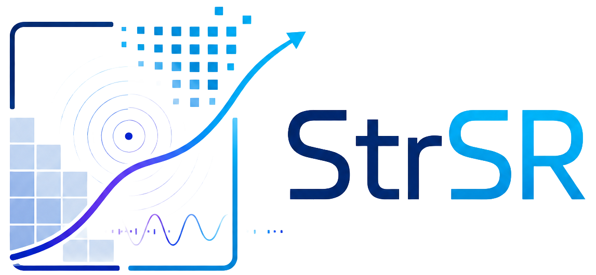
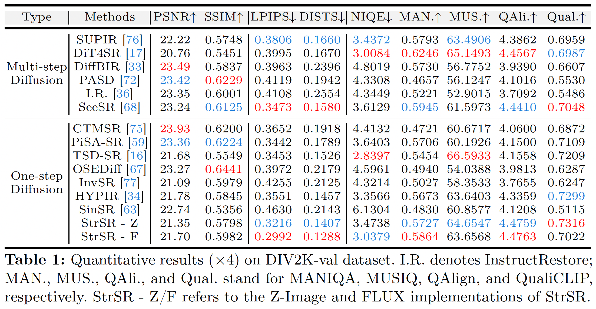
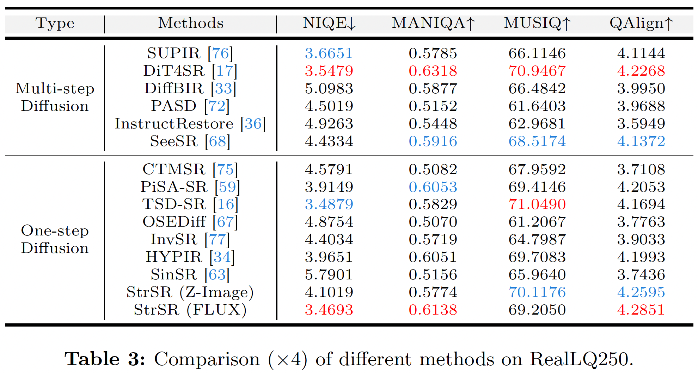
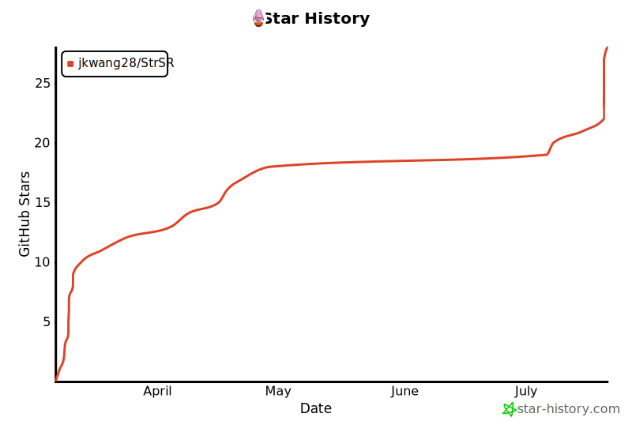

<p align="center">
  
</p>

# [ECCV 2026] Spectral and Trajectory Regularization for Diffusion Transformer Super-Resolution

&#8224;Equal Contribution, \*Corresponding Authors
[Jingkai Wang&#8224;](https://jingkaiwang.com), [Yixin Tang&#8224;](https://github.com/YOU-EEE), [Jue Gong](https://github.com/gobunu), Jiatong Li, Shu Li, Libo Liu, Jianliang Lan, [Yutong Liu\*](https://isabelleliu630.github.io/), [Yulun Zhang\*](http://yulunzhang.com/), "Spectral and Trajectory Regularization for Diffusion Transformer Super-Resolution", ECCV, 2026

[](https://jkwang28.github.io/StrSR/)
[](https://arxiv.org/abs/2603.06275)
[](https://huggingface.co/jkwang28/StrSR)
[](https://github.com/jkwang28/StrSR/releases)
[](https://github.com/jkwang28/StrSR)
[](https://github.com/jkwang28/StrSR)

#### 🔥🔥🔥 News

- **2026-07-20** Models and code are released. 
- **2026-06-17** Congratulations! StrSR has been accepted to ECCV 2026. See you in Malmö 🇸🇪🇸🇪🇸🇪
- **2026-03-06:** This repo is released.

---

> **Abstract:** Diffusion transformer (DiT) architectures show great potential for real-world image super-resolution (Real-ISR). However, their computationally expensive iterative sampling necessitates one-step distillation. Existing one-step distillation methods struggle with Real-ISR on DiT. They suffer from fundamental trajectory mismatch and generate severe grid-like periodic artifacts. To tackle these challenges, we propose StrSR, a novel one-step adversarial distillation framework featuring spectral and trajectory regularization. Specifically, we propose an asymmetric discriminative distillation architecture to bridge the trajectory gap. Additionally, we design a frequency distribution matching strategy to effectively suppress DiT-specific periodic artifacts caused by high-frequency spectral leakage. Experiments demonstrate that StrSR achieves state-of-the-art performance in Real-ISR, across both quantitative metrics and visual perception.


---

## 🔗 Contents

- [x] [Environment](#environment)
- [x] [Training](#training)
- [x] [Datasets](#datasets)
- [x] [Models](#models)
- [x] [Inference](#inference)
- [x] [Results](#results)
- [x] [Citation](#citation)
- [x] [License and Third-Party Notices](#license)
- [x] [Acknowledgements](#acknowledgements)

## <a name="environment"></a>⚒️ Environment

1. Create conda environment with Python 3.10. (`conda create -n strsr python=3.10`)
2. Install [PyTorch 2.6.0](https://pytorch.org/get-started/previous-versions/#v260). (`pip install torch==2.6.0 torchvision==0.21.0 torchaudio==2.6.0 --index-url https://download.pytorch.org/whl/cu124`)
3. Install `requirements.txt`. (`pip install -r requirements.txt`)
4. Install `pyiqa` separately with `--no-deps`. (`pip install --no-deps pyiqa==0.1.15.post2`)
5. Install `flash-attn`. (`pip install flash-attn==2.7.4.post1 --no-build-isolation`)

## <a name="training"></a>🔥 Training

1. Download the training datasets and pretrained models described below.
2. Update the dataset and model paths in the stage 1 and stage 2 configuration files for the model you want to train:

   - FLUX: `configs/flux_train_stage1.yaml` and `configs/flux_train_stage2.yaml`
   - Z-Image: `configs/zimage_train_stage1.yaml` and `configs/zimage_train_stage2.yaml`
3. Run both training stages in order. Stage 2 resumes from the final stage 1 checkpoint (`checkpoint-40000`) and continues training until step 60000. Run the commands from the repository root.

The stage 2 configurations already set `resume_from_checkpoint` to `exps/flux_s1/checkpoint-40000` and `exps/zimage_s1/checkpoint-40000`, respectively. The corresponding stage 1 configurations start without a checkpoint.

**FLUX:**

```bash
# Stage 1: steps 1-40000. train.sh is a shortcut for this command.
TORCH_DISTRIBUTED_DEBUG=DETAIL \
PYTORCH_CUDA_ALLOC_CONF=expandable_segments:True \
accelerate launch --mixed_precision=bf16 train.py \
    --config configs/flux_train_stage1.yaml

# Stage 2: resume from exps/flux_s1/checkpoint-40000 and continue to step 60000.
TORCH_DISTRIBUTED_DEBUG=DETAIL \
PYTORCH_CUDA_ALLOC_CONF=expandable_segments:True \
accelerate launch --mixed_precision=bf16 train.py \
    --config configs/flux_train_stage2.yaml
```

**Z-Image:**

```bash
# Stage 1: steps 1-40000.
TORCH_DISTRIBUTED_DEBUG=DETAIL \
PYTORCH_CUDA_ALLOC_CONF=expandable_segments:True \
accelerate launch --mixed_precision=bf16 train.py \
    --config configs/zimage_train_stage1.yaml

# Stage 2: resume from exps/zimage_s1/checkpoint-40000 and continue to step 60000.
TORCH_DISTRIBUTED_DEBUG=DETAIL \
PYTORCH_CUDA_ALLOC_CONF=expandable_segments:True \
accelerate launch --mixed_precision=bf16 train.py \
    --config configs/zimage_train_stage2.yaml
```

## <a name="datasets"></a>📊 Datasets

**Training Dataset:**

- [LSDIR](https://huggingface.co/ofsoundof/LSDIR)
- [Aesthetic-4K](https://huggingface.co/datasets/zhang0jhon/Aesthetic-4K)
- [Aesthetic-Train-V2](https://huggingface.co/datasets/zhang0jhon/Aesthetic-Train-V2)

**Testing Dataset:**

- [DIV2K-val](https://data.vision.ee.ethz.ch/cvl/DIV2K/) (Agustsson & Timofte, CVPRW NTIRE 2017)
- [RealSR](https://github.com/csjcai/RealSR) (Cai et al., ICCV 2019)
- [RealLQ250](https://github.com/shallowdream204/DreamClear) (Ai et al., NeurIPS 2024)

We have put all the test data in `testdata/` in [Hugging Face repository](https://huggingface.co/jkwang28/StrSR). 

## <a name="models"></a>🤗 Models

Download [Z-Image-Turbo](https://huggingface.co/Tongyi-MAI/Z-Image-Turbo),
[FLUX.2-klein-base-4B](https://huggingface.co/black-forest-labs/FLUX.2-klein-base-4B),
[Qwen3-VL-4B-Instruct](https://huggingface.co/Qwen/Qwen3-VL-4B-Instruct), and
[CLIP-convnext_xxlarge-laion2B-s34B-b82K-augreg-soup](https://huggingface.co/laion/CLIP-convnext_xxlarge-laion2B-s34B-b82K-augreg-soup).
Please refer to the [Hugging Face repository](https://huggingface.co/jkwang28/StrSR) for the StrSR checkpoints and organize all models as follows:

```
pretrained
├── CLIP-convnext_xxlarge-laion2B-s34B-b82K-augreg-soup
│   └── ...
├── FLUX.2-klein-base-4B
│   └── ...
├── Qwen3-VL-4B-Instruct
│   └── ...
├── Z-Image-Turbo
│   └── ...
├── StrSR-flux
│   ├── projector.pth
│   └── state_dict.pth
└── StrSR-zimage
    ├── projector.pth
    └── state_dict.pth
```

## <a name="inference"></a>🧮 Inference

GPU VRAM >= 40 GB. 

Run the inference wrappers with Bash:

```bash
bash test_zimage.sh
bash test_flux.sh
```

The wrappers use Qwen3-VL conditioning by default. To use a user-provided text
prompt instead, select the text conditioning mode and pass `--prompt`:

```bash
bash test_zimage.sh --conditioning txt --prompt "a highly detailed realistic image"
bash test_flux.sh --conditioning txt --prompt "a highly detailed realistic image"
```

## <a name="results"></a>🔎 Results

We achieved state-of-the-art performance on synthetic and real-world datasets.

<details>
<summary>&ensp;Quantitative Comparisons (click to expand) </summary>
<li> Results in Table 1 on synthetic dataset (DIV2K-Val) from the main paper. 
<p align="center">

</p>
</li>
<li> Results in Table 2 on real-world dataset (RealSR) from the main paper. 
<p align="center">

</p>
</li>
<li> Results in Table 3 on real-world dataset (RealLQ250) from the main paper. 
<p align="center">

</p>
</li>
</details>
<details open>
<summary>&ensp;Visual Comparisons (click to expand) </summary>
<li> Results in Figure 7 on synthetic dataset (DIV2K-Val) from the main paper.
<p align="center">

</p>
</li>
<li> Results in Figure 8 on real-world dataset (RealSR) from the main paper.
<p align="center">

</p>
</li>
<li> Results in Figure 9 on real-world dataset (RealLQ250) from the main paper.
<p align="center">

</p>
</li>
</details>

## <a name="citation"></a>📎 Citation

If you find the code helpful in your research or work, please cite the following paper(s).

```
@inproceedings{wang2026strsr,
    title={Spectral and Trajectory Regularization for Diffusion Transformer Super-Resolution},
    author={Jingkai Wang and Yixin Tang and Jue Gong and Jiatong Li and Shu Li and Libo Liu and Jianliang Lan and Yutong Liu and Yulun Zhang},
    booktitle={European Conference on Computer Vision},
    year={2026}
}
```

## <a name="license"></a>⚖️ License and Third-Party Notices

StrSR is built on and includes/adapts code from [HYPIR](https://github.com/XPixelGroup/HYPIR). Please read and comply with HYPIR's [Non-Commercial Use Only Declaration](https://github.com/XPixelGroup/HYPIR#non-commercial-use-only-declaration). The HYPIR attribution and those restrictions apply to the HYPIR-derived portions of this repository.

## <a name="acknowledgements"></a>💡 Acknowledgements

This code is built on [HYPIR](https://github.com/XPixelGroup/HYPIR). Thanks to [LSDIR](https://ofsoundof.github.io/lsdir-data/) and [Aesthetic-4K](https://github.com/zhang0jhon/diffusion-4k) for the dataset. 

<a href="https://github.com/jkwang28/StrSR/stargazers">
  <picture>
    <source
      media="(prefers-color-scheme: dark)"
      srcset="./assets/star-history/star-history-dark.svg"
    />
    <source
      media="(prefers-color-scheme: light)"
      srcset="./assets/star-history/star-history-light.svg"
    />
    
  </picture>
</a>